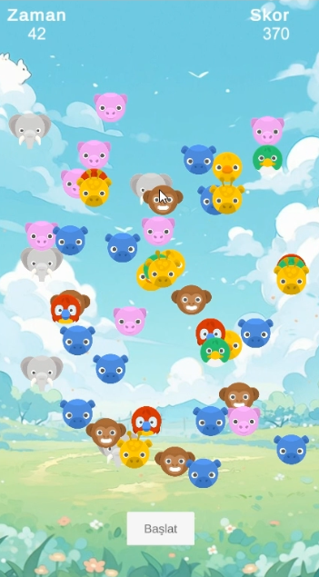

# Animals Match-3 Puzzle Game (Unity)

A simple **Animals Match-3 Puzzle Game** built with Unity.  
Players can swap tiles to make matches of three or more identical tiles.  
The game includes a **score system** and a **countdown timer**.  

---

## Features
- Match-3 core gameplay mechanics
- Board shuffle when no moves are available
- Automatic detection and clearing of 3+ matches
- **Score system**: Points are awarded for every match
- **Timer system**: 60-second countdown
- Game ends when the timer reaches 0
- Final score is displayed at the end

---

## UI
- **TimeText** → Displays remaining time (60s countdown)
- **ScoreText** → Displays current score
- **StartButton** → Starts the game
- **Game Over Screen** → Shows final score after the timer ends

---

## How to Play
1. Press the **Start** button to begin the game.
2. Swap tiles to match 3 or more identical tiles.
3. Each match increases your score.
4. The game lasts for **60 seconds**.
5. When the timer reaches 0, the board disappears and your final score is displayed.

---

## Tech Stack
- **Engine:** Unity (2021+ recommended)
- **Language:** C#    

---

## Screenshots

  
  
  

🎥 **Demo Video:** [Watch on YouTube](https://youtu.be/RHT29ZF-4nE)
